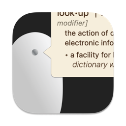
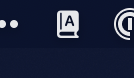

	
	<h1>Click to Look Up</h1>
	

		<b>Look up words by clicking a middle mouse button</b>
	

	 
	 
	 

This app allows you to look up words with macOS built-in dictionary by clicking a middle mouse button. Just like you do force touch click with trackpad (or three-finger click).

It's a menu bar app. If you see this little icon on menu bar, you are ready to use. Go middle click on a word!

## Download
[Download 1.0.0](https://github.com/tobark/Click-to-Look-Up/releases/download/v1.0.0/Click_to_Look_Up_1.0.0.zip)

Requires macOS 13 or later.

## Built with
- [LaunchAtLogin-Modern](https://github.com/sindresorhus/LaunchAtLogin-Modern)
